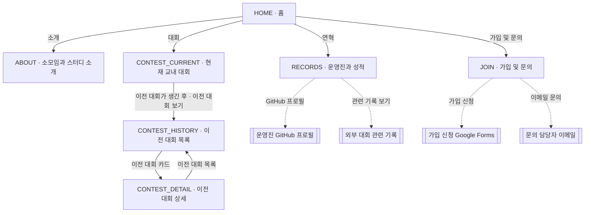
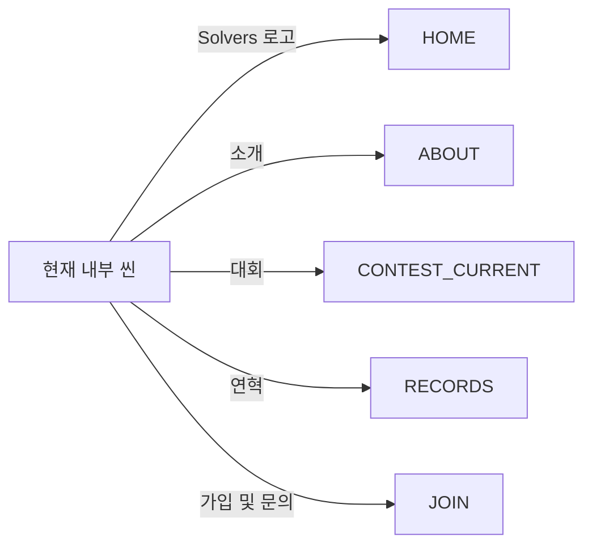

# Solvers 홈페이지 설계

## 1. 문서 목적

이 문서는 알고리즘 소모임 **Solvers**의 공식 홈페이지를 구현하기 위한 초기 설계안이다.
홈페이지의 목표, 정보 구조, 기술 스택, 콘텐츠 관리 방식, GitHub Actions 기반 배포 흐름을 한곳에 정리한다.

이 문서에서 정한 내용은 첫 구현의 기준이며, 운영 과정에서 소모임의 실제 요구에 맞게 변경할 수 있다.

## 2. 프로젝트 목표

홈페이지는 다음 역할을 수행한다.

1. Solvers가 어떤 소모임인지 명확하게 소개한다.
2. 초급반과 중급반이 무엇을 하는 스터디인지 외부 방문자에게 소개한다.
3. 교내 대회 개최와 외부 대회 참여 경험을 Solvers의 주요 활동으로 보여준다.
4. 신규 구성원이 소모임에 관심을 갖고 참여 방법을 쉽게 찾을 수 있게 한다.
5. 운영진이 Markdown 파일 수정만으로 주요 콘텐츠를 관리할 수 있게 한다.
6. `main` 브랜치의 변경 사항을 GitHub Actions로 자동 빌드하고 GitHub Pages에 배포한다.
7. 포스터나 안내문에 인쇄된 QR 코드로 접속한 사용자에게 데스크톱과 모바일 모두에서 편안한 이용 경험을 제공한다.

### 공식 표어

> **We make better solvers.**

문제를 더 잘 해결하는 사람으로 함께 성장한다는 의미를 담는다. 홈페이지, 소셜 이미지, 포스터 등 모든 공식 매체에서 영문 문장과 마침표를 포함한 동일한 표기를 사용한다.

## 3. 대상 사용자

| 사용자                | 필요한 정보                                               |
| --------------------- | --------------------------------------------------------- |
| 가입 희망자           | 소모임 소개, 주요 활동, 모집 정보, 지원 방법              |
| 교내 구성원           | 스터디, 교내 대회, 외부 대회 참여 등 Solvers의 활동       |
| 졸업생 및 외부 방문자 | 구성원과 소모임의 활동 및 경험                            |
| 사이트 관리자         | 쉽게 수정할 수 있는 소개 콘텐츠 구조와 안정적인 배포 방식 |

## 4. 핵심 원칙

- **콘텐츠 우선:** 화려한 효과보다 활동과 성과가 잘 읽히는 구성을 우선한다.
- **정적 사이트 우선:** GitHub Pages에서 빠르고 안정적인 정적 페이지를 제공한다.
- **쉬운 유지보수:** 반복되는 정보는 Markdown 또는 데이터 파일로 관리한다.
- **PC·모바일 동등 지원:** 데스크톱과 모바일을 모두 주요 이용 환경으로 보고 각 화면 크기에 적합한 탐색과 읽기 경험을 제공한다.
- **QR 진입 최적화:** QR 스캔 직후 핵심 정보와 행동 버튼을 바로 확인할 수 있어야 한다.
- **접근성 기본 준수:** 키보드 탐색, 충분한 명암비, 의미 있는 HTML, 대체 텍스트를 적용한다.
- **자동화:** 빌드, 검사, 배포를 GitHub Actions에서 일관되게 수행한다.

## 5. 사이트 구조

초기 사이트맵은 다음과 같다.

```text
/
├── /about          소모임과 스터디 소개
├── /records        운영진과 외부 대회 성적 연혁
├── /contest        제1회 공식 대회: 2026년 가을
│   ├── /history    향후 이전 교내 대회 목록
│   └── /[year]/[season]  향후 연도·시즌별 대회 상세 페이지
└── /join           가입 및 문의
```

### 5.1 홈

- 소모임 이름과 공식 표어 `We make better solvers.`
- `소개`, `대회`, `연혁`, `가입 및 문의` 네 개의 바로가기
- 일반적인 데스크톱과 모바일 화면에서 주요 버튼 전체가 첫 뷰포트 안에 표시되는 단일 화면 구성
- 자세한 정보와 행동은 연결된 하위 씬에서 제공
- 홈의 대회 챕터는 특정 회차의 홍보보다 매년 봄·가을 대회를 기획하고 개최하는 활동의 방향을 소개
- 포스터 공개 전 `CONTEST_CURRENT` 씬은 `준비 중` 한 문장으로 구성하고, 공개 시 현재 회차의 표어, 일정, 장소와 규칙을 함께 제공
- PC와 모바일 홈 모두 헤더 없이 챕터 화면이 전체 뷰포트를 사용
- 데스크톱에서는 왼쪽에 선택한 챕터의 내용을 책장처럼 표시하고 오른쪽에 네 개의 챕터 버튼을 세로로 배치
- 홈 챕터는 짧은 영문 제목과 한글 설명, 하위 씬으로 이동하는 링크를 중심으로 구성
- 표어, 설명, 하위 씬 링크는 PC와 모바일 모두 콘텐츠 영역 하단에 정렬
- 선택된 챕터는 5초마다 순서대로 교체되며 버튼을 누르면 해당 챕터로 즉시 전환
- 모바일에서는 선택한 내용을 위에 표시하고 네 개의 챕터 버튼을 화면 하단에 한 줄로 배치
- 모바일 홈의 네 단어 이상 제목은 두 단어씩 묶어 줄을 나눈다.

### 5.2 소개

- `Solvers는 한신대학교 알고리즘 소모임으로, 다음과 같은 활동을 하고 있습니다.`를 첫 문장에 명시
- 주요 활동을 `스터디`, `대회 개최`, `대회 참여` 세 개의 독립된 문단으로 나누어 소개
- 초급반과 중급반은 `스터디` 활동의 하위 항목으로 배치하고 각 반에서 무엇을 공부하는지 설명
- `대회 개최` 문단의 `교내 알고리즘 대회`는 `/contest`로 이동하는 내부 링크로 제공
- 소개와 활동이 짧은 문단으로 이어지는 서술형 구성

| 트랙   | 홈페이지에서 설명할 내용                     |
| ------ | -------------------------------------------- |
| 초급반 | 구현, 시뮬레이션, 기초 자료구조, 재귀, 정수론 |
| 중급반 | 동적 계획법(DP), 그리디, 탐색(DFS, BFS), 누적합, 그래프 이론, 트리, 최단 경로 알고리즘 |

각 트랙은 이름과 학습 내용만 표시한다.

### 5.3 연혁

- `/records` 한 페이지에 `운영진`과 `외부 대회 성적` 두 영역을 제공
- 상단의 연도 버튼을 선택하면 새 페이지로 이동하지 않고 해당 연도의 성적만 같은 자리에서 표시
- 연혁 본문에서는 선택된 연도를 다시 제목으로 반복하지 않는다.
- 운영진 영역은 직책, 이름, 연락처를 간결한 한 줄 정보로 표시
- 운영진 연락처는 보라색으로 강조하지 않고 일반 본문 색으로 표시
- 성적 영역은 대회명, 연도, 참가자, 참가 부문, 결과와 요약을 최신순으로 표시
- 관련 외부 기록 주소가 있는 성적에는 `관련 기록 보기` 링크를 표시
- 개인정보 공개 범위와 대회 결과는 확인된 정보를 기준으로 작성
- 운영진과 성적은 카드나 구분선 없이 짧은 글 단위로 표시

### 5.4 교내 대회 개최

- 교내 알고리즘 대회는 매년 봄과 가을, 연 2회 개최
- 2026년 봄에도 교내 알고리즘 대회를 개최했으며 대회 탭에는 `2026: Spring`으로 표시
- `2026: Spring`에는 대회 포스터를 표시하고, 포스터 아래 설명은 `2026-spring.md`의 `summary`에서 작성한다.
- `2026: Spring` 설명의 일정과 장소는 각각 `일시 : 내용`, `장소 : 내용` 형식으로 표시한다.
- `2026: Fall`에는 `10월 중 예정(상세 일시 미정)`과 `한신대학교 장준하통일관 (상세 장소 미정)`을 같은 형식으로 표시한다.
- 첫 공식 대회는 `2026-fall`, 제1회 대회로 정의
- `/contest`는 다른 내부 화면과 같은 제목·본문 양식을 사용하고, 포스터 공개 전 본문에 `준비 중`만 표시
- 대회는 `2026: Fall`, `2027: Spring`처럼 `연도: 시즌` 단위의 버튼으로 구분
- 대회 버튼을 선택하면 새 페이지로 이동하지 않고 해당 연도·시즌의 대회만 같은 자리에서 표시
- 대회 버튼과 내용은 최신 연도 우선, 같은 연도에서는 `Fall` 다음 `Spring` 순서로 배치하고 첫 항목을 기본 선택
- 대회와 연혁의 기간 선택 버튼은 콘텐츠 영역 중앙에 정렬한다.
- 선택된 대회 기간은 버튼에서 이미 확인할 수 있으므로 본문에서 `2026: Spring` 같은 기간 제목을 반복하지 않는다.
- 대회 포스터는 일반적인 PC·모바일 화면에서 별도 스크롤이 생기지 않도록 뷰포트 높이에 맞춰 축소한다.
- 포스터 공개 시 제1회 2026년 가을 교내 알고리즘 대회의 목적, 일정, 참가 대상, 진행 방식과 규칙을 표시
- 이후 대회가 개최되면 `/contest/history`에서 이전 대회를 연도별로 묶고 각 연도의 봄·가을 카드를 표시
- 이전 대회 카드를 누르면 `/contest/[year]/[season]`의 개별 상세 페이지로 이동
- 이전 대회 상세 페이지에는 해당 대회의 소개, 개최 정보, 결과, 사진 등 공개 가능한 기록을 표시
- 제1회 `2026-fall` 대회의 표어는 `Detect, Think, Solve,`

첫 배포의 교내 대회 동선은 `HOME → CONTEST_CURRENT`로 구성한다. 이전 대회 목록과 상세 템플릿은 함께 구현하고, 다음 공식 대회 콘텐츠가 추가되는 시점에 `CONTEST_HISTORY`와 `CONTEST_DETAIL` 동선이 활성화된다.

### 5.5 가입 및 문의

- `/join`은 가입 신청 링크와 문의 담당자 정보를 하나의 통합 영역에 배치
- 가입 신청은 Google Forms 링크로 연결하고 QR 코드 이미지를 추가할 수 있도록 구성
- 가입 신청 링크는 그림자나 채운 배경 없이 테두리와 외부 이동 표시를 사용한 절제된 버튼으로 제공
- 모바일에서는 가입 신청 버튼을 한 줄 너비와 최소 `48px` 높이로 표시해 누르기 쉽게 구성
- 문의는 `IT영상콘텐츠학과 김성수`와 `4thrun@hs.ac.kr`을 표시하고 이메일 주소를 `mailto:` 링크로 제공
- 모바일에서도 담당자와 이메일은 공간이 충분하면 한 줄로 표시하고, 실제 너비가 부족할 때만 자연스럽게 줄바꿈한다.
- 가입 링크, QR 코드 이미지와 문의 정보는 Markdown 콘텐츠에서 교체
- 가입과 문의는 카드나 구분선 없이 같은 글 흐름 안에 표시
- 가입 신청 버튼과 문의 이메일은 보라색 강조를 사용하지 않고 일반 본문 색과 중성 테두리로 표시한다.

### 5.6 씬 구성과 화면 이동

각 독립 페이지를 하나의 **씬(Scene)**으로 정의한다. 버튼과 클릭 가능한 카드는 사용자가 Solvers의 활동을 더 알아보거나 참여 행동으로 이어지도록 다음 씬에 연결한다.

| 씬 ID             | 화면           | 주요 이동 요소                                                     |
| ----------------- | -------------- | ------------------------------------------------------------------ |
| `HOME`            | 홈             | 소개, 대회, 연혁, 가입 및 문의                                     |
| `ABOUT`           | 소개           | 주요 활동과 초급반·중급반 소개                                     |
| `RECORDS`         | 연혁           | 운영진 GitHub 프로필, 외부 대회 관련 기록                          |
| `CONTEST_CURRENT` | 현재 교내 대회 | 포스터 공개 전 `준비 중` 표시, 공개 후 제1회 2026년 가을 대회 소개 |
| `CONTEST_HISTORY` | 이전 교내 대회 | 다음 공식 대회 콘텐츠 추가 후 연도별 봄·가을 대회 카드 제공        |
| `CONTEST_DETAIL`  | 이전 대회 상세 | 다음 공식 대회 콘텐츠 추가 후 선택한 대회의 소개와 결과 제공       |
| `JOIN`            | 가입 및 문의   | 가입 신청 링크와 QR 코드, 문의 담당자와 이메일                     |

#### 주요 사용자 흐름



실선은 홈페이지 내부 씬 이동, 점선은 GitHub 프로필, 활동 기록, 가입 신청 폼, 이메일 앱 등의 외부 이동을 의미한다.

#### 공통 내비게이션 흐름

소개, 대회, 연혁, 가입 및 문의 등 모든 내부 씬의 헤더에는 같은 내비게이션을 제공한다. 로고는 항상 홈으로 이동하며, PC와 모바일 모두 각 항목을 바로 누를 수 있는 텍스트 링크로 표시한다. 홈에서는 헤더를 표시하지 않는다.



외부 링크는 새 탭으로 열고 버튼 또는 링크 주변에서 외부 이동임을 알 수 있게 표시한다. 실제 구현에는 목적지가 확정된 버튼을 노출한다.

## 6. 디자인 방향

### 6.1 분위기

Solvers라는 이름이 전달하는 **문제 해결, 논리, 성장**을 시각 언어로 표현한다.
전체 인상은 기술적이며 대학 소모임다운 활기와 친근함을 함께 전달한다.

제품 디자인의 기준은 토스에서 느낄 수 있는 간결하고 신뢰감 있는 사용자 경험을 참고한다. 핵심 원칙을 Solvers의 정체성에 맞게 재해석한다.

- 한 화면에서 가장 중요한 메시지와 행동 하나가 먼저 보이게 한다.
- 큰 제목, 짧은 문장, 넉넉한 여백으로 정보의 우선순위를 명확하게 만든다.
- 설명을 길게 나열하기보다 작은 콘텐츠 단위와 명확한 섹션으로 나눈다.
- 장식보다 타이포그래피, 정렬, 간격으로 완성도를 만든다.
- 버튼 문구는 다음 행동이 바로 이해되도록 구체적으로 작성한다.
- 전문성과 대학 소모임다운 친근함을 함께 표현한다.

홈 화면의 첫 인상은 공식 표어를 중심으로 구성한다.

```text
We make better solvers.
```

영문 공식 표어는 일관되게 유지한다.

### 6.2 시각 요소

- 흰색 또는 아주 옅은 회색 배경과 짙은 텍스트를 기본으로 사용한다.
- 한신대학교 상징색 `#472F91`을 핵심 행동과 강조 요소에 집중해 사용한다.
- 큰 제목은 굵게, 본문은 편안한 행간으로 설정해 한글 가독성을 높인다.
- 홈 챕터의 영문 제목은 가능한 한 한 줄로 표시하고, 줄바꿈 시 두 단어 단위의 의미 묶음을 유지한다.
- 코드, 그래프, 노드 등 알고리즘을 연상시키는 요소는 히어로나 빈 상태에만 절제해 사용한다.
- 내부 화면은 짧은 문단과 넉넉한 여백을 중심으로 구성하고 독립된 행동이나 강조가 필요한 콘텐츠에만 카드를 사용한다.
- 아이콘은 의미 전달을 돕는 경우에만 사용하며 한 가지 스타일로 통일한다.
- 타이포그래피와 여백, 중립적인 면을 기본으로 하고 학교 보라색은 선택 상태와 핵심 링크에만 사용한다.
- 동아리명 `Solvers` 워드마크는 `Montserrat Alternates Thin`을 사용한다.
- 본문은 `Pretendard`, `Inter`, 시스템 sans-serif 순서의 글꼴 스택을 후보로 한다.
- 코드 및 수치는 고정폭 글꼴로 구분할 수 있다.

초기 색상 후보:

| 용도            | 색상      |
| --------------- | --------- |
| 배경            | `#F9FAFB` |
| 표면            | `#FFFFFF` |
| 기본 텍스트     | `#191F28` |
| 보조 텍스트     | `#6B7684` |
| 주요 색상       | `#472F91` |
| 주요 색상 hover | `#33206F` |
| 약한 강조 배경  | `#F2F3F5` |
| 테두리          | `#E5E8EB` |

색상은 실제 화면을 구현한 뒤 WCAG AA 명암비를 확인하며 조정한다. 초기 버전은 라이트 테마로 구성하고, 색상은 추후 테마 확장이 가능한 CSS 변수로 정의한다.

### 6.3 반응형 기준

PC와 모바일을 동등한 기준 환경으로 삼는다. 같은 정보 구조를 유지하면서 각 환경에 적합한 레이아웃을 별도로 설계하고 검증한다.

- 모바일: `0px ~ 767px`
- 태블릿: `768px ~ 1023px`
- 데스크톱: `1024px 이상`
- 공통 헤더와 푸터도 상세 콘텐츠와 같은 중앙 `800px` 축에 맞춘다.
- 소개, 대회, 연혁, 가입 및 문의의 상세 콘텐츠는 화면 중앙의 최대 `800px` 안에 배치한다.
- 소개, 대회, 연혁, 가입 및 문의의 대표 제목은 대회 화면을 기준으로 같은 높이에서 시작한다.
- 소개 화면의 긴 문장은 Markdown에 지정한 줄바꿈을 `560px` 이하 화면에서만 적용하고, PC에서는 한 문장으로 이어서 표시한다.
- 모바일 상세 화면에서도 모든 내비게이션 항목을 로고와 같은 한 줄의 헤더에 바로 노출한다. 항목 사이에는 작은 간격을 두고 각 링크의 최소 `44px` 터치 높이를 확보한다.
- 화면 너비 `320px`에서도 핵심 콘텐츠가 뷰포트 안에 표시되어야 한다.
- 버튼과 링크의 터치 영역은 가급적 최소 `44px × 44px`를 확보한다.
- 모든 정보와 기능은 터치, 클릭, 포커스 상태에서 동일하게 접근할 수 있어야 한다.
- 표와 긴 코드처럼 폭이 넓은 콘텐츠는 모바일에서 안전하게 스크롤되거나 카드 형태로 전환한다.

반응형 레이아웃은 기기별 콘텐츠 우선순위와 사용 가능한 공간에 맞춰 배치한다.

| 요소        | 모바일                            | 데스크톱                         |
| ----------- | --------------------------------- | -------------------------------- |
| 내비게이션  | 로고와 간결한 가로 메뉴           | 로고와 가로 메뉴                 |
| 홈 챕터     | 하단 정렬 내용과 하단 1×4 선택 칸 | 왼쪽 하단 내용과 오른쪽 세로 4칸 |
| 본문 머리말 | 한 열의 제목과 짧은 설명          | 같은 구조에 넓은 여백 적용       |
| 콘텐츠      | 짧은 문단을 세로로 배치           | 읽기 폭을 유지한 같은 구조       |
| 주요 버튼   | 쉽게 누를 수 있는 넓은 버튼       | 콘텐츠 너비에 맞는 버튼          |
| 긴 목록     | 핵심 항목 우선 표시               | 더 많은 메타데이터 표시 가능     |

### 6.4 컴포넌트 스타일 원칙

- **헤더:** PC와 모바일 홈은 챕터 콘텐츠에 전체 화면을 할당하도록 헤더를 숨긴다. 내부 씬에서는 왼쪽 로고와 오른쪽의 주요 메뉴를 바로 이동 가능한 텍스트 링크로 배치한다. 헤더 아래에는 콘텐츠와 내비게이션을 구분하는 선을 유지한다.
- **푸터:** 푸터 위에는 본문과 푸터를 구분하는 선을 유지하고, 워드마크 대신 저작권 문구를 표시한다.
- **화면 높이:** 콘텐츠가 짧은 내부 화면은 푸터를 뷰포트 하단에 배치하고 한 화면 안에 내용을 표시한다. 콘텐츠가 길어지면 문서 흐름에 따라 세로로 확장한다.
- **홈 챕터:** 데스크톱의 오른쪽 챕터 선택과 모바일의 하단 챕터 선택으로 내용을 전환하며 5초 자동 넘김을 제공한다.
- **버튼:** 기본, 보조, 텍스트 세 단계만 사용한다. 기본 버튼은 주요 색상과 흰색 텍스트를 사용한다.
- **기간 탐색:** 대회는 `연도: 시즌`, 연혁은 연도 단위의 작은 테두리 탭으로 제공하고 선택한 기간의 내용만 같은 자리에서 표시한다. 선택된 탭은 학교 보라색과 흰색 글자로 표시한다.
- **카드:** 독립된 행동이나 강조가 필요한 콘텐츠에 사용하며 제목, 한두 줄 설명, 필요한 메타데이터와 링크만 담는다. 카드 전체가 클릭되는 경우 포커스 상태를 명확히 한다.
- **본문:** 소개, 대회, 연혁, 가입 및 문의 화면은 제목과 짧은 문단을 중심으로 구성한다.
- **제목:** 내부 화면의 대표 제목은 모바일 약 `28px`, 데스크톱 최대 `32px` 범위로 절제한다.
- **목록:** 활동, 스터디, 운영진, 대회 정보는 여백과 글자 크기로 위계를 표현한다.
- **섹션:** 충분한 상하 여백으로 내용을 구분한다.
- **라벨:** 초급반, 중급반, 교내 개최, 외부 참여처럼 활동의 성격을 구분할 때만 짧고 일관된 라벨을 사용한다.
- **애니메이션:** 작은 등장 및 상태 전환에 `150~300ms` 범위로 사용하며 콘텐츠 가독성을 유지한다.

### 6.5 QR 링크 유입 호환성

- QR 링크의 진입 화면은 홈으로 구성한다.
- 첫 화면에서 `소개`, `대회`, `연혁`, `가입 및 문의` 네 개의 이동 버튼을 바로 노출한다.
- QR 진입 시 핵심 콘텐츠와 주요 행동 버튼을 바로 표시한다.
- 카카오톡, 네이버, 인스타그램 등의 모바일 인앱 브라우저에서도 핵심 탐색과 외부 링크가 동작해야 한다.
- 가입 링크와 QR 코드는 같은 외부 신청 폼으로 연결한다.

## 7. 기술 설계

### 7.1 기술 스택

| 영역        | 선택                                 | 이유                                               |
| ----------- | ------------------------------------ | -------------------------------------------------- |
| 프레임워크  | Astro                                | 정적 콘텐츠 중심 사이트에 적합하고 결과물이 가벼움 |
| 언어        | TypeScript                           | 콘텐츠와 컴포넌트 타입 오류를 사전에 방지          |
| 스타일      | CSS + Astro scoped styles            | 초기 의존성을 줄이고 디자인 시스템을 명확히 관리   |
| 콘텐츠      | Astro Content Collections + Markdown | 스키마 검증과 쉬운 콘텐츠 작성                     |
| 패키지 관리 | npm                                  | GitHub Actions와의 단순한 연동                     |
| 코드 품질   | ESLint, Prettier                     | 일관된 형식과 기본 정적 검사                       |
| 배포        | GitHub Pages + GitHub Actions        | 저장소 기반 정적 호스팅과 자동 배포                |

초기 UI는 Astro 컴포넌트로 구성한다. 클라이언트 상태가 필요한 기능은 작은 단위의 UI 런타임으로 구현한다.

### 7.2 예상 디렉터리 구조

```text
.
├── .github/
│   └── workflows/
│       ├── ci.yml
│       └── deploy.yml
├── public/
│   ├── favicon.jpg
│   └── images/
│       └── contests/
│           └── 2026-spring.png
├── src/
│   ├── components/
│   ├── content/
│   │   ├── home/
│   │   ├── studies/
│   │   ├── contests/
│   │   ├── members/
│   │   └── competitions/
│   ├── layouts/
│   ├── pages/
│   ├── styles/
│   ├── content.config.ts
│   └── site.config.ts
├── scripts/
│   └── validate-content.mjs
├── astro.config.mjs
├── package.json
├── README.md
└── design.md
```

### 7.3 콘텐츠 모델

Markdown 수정이 화면에 반영되는 방식은 다음과 같다.

```text
src/content 아래의 Markdown 수정
  → frontmatter 스키마 검증
  → 각 씬의 템플릿이 데이터를 읽어 HTML 생성
  → GitHub Actions 빌드 및 배포
```

루트의 `README.md`는 저장소 안내 문서로 사용한다. 홈페이지 콘텐츠는 `src/content` 아래에 둔다. Markdown 본문의 용도는 컬렉션별 작성 규칙을 따르고, 파일 상단의 `---` 사이에 있는 frontmatter는 `src/content.config.ts`에 정의된 스키마로 검증한다.

```text
src/content/
├── home/index.md                 HOME 씬 콘텐츠
├── about/index.md                ABOUT 씬 소개 콘텐츠
├── join/index.md                 JOIN 씬 가입·문의 콘텐츠
├── studies/index.md              ABOUT 씬의 초급반·중급반 콘텐츠
├── contests/2026-fall.md         제1회 공식 대회 콘텐츠
├── contests/[year]-[season].md   향후 추가할 봄·가을 대회 콘텐츠
├── members/[slug].md             RECORDS 씬의 운영진별 소개
└── competitions/[slug].md        RECORDS 씬의 외부 대회 성적
```

각 컬렉션의 스키마는 다음을 기준으로 한다.

| 컬렉션         | 필수 필드                                                                                                      | 선택 필드                                                     |
| -------------- | -------------------------------------------------------------------------------------------------------------- | ------------------------------------------------------------- |
| `home`         | `title`, `slogan`, `chapters`                                                                                  | —                                                             |
| `about`        | `title`, `intro`, `activities`                                                                                 | `activities[].linkText`, `activities[].linkTo`                |
| `join`         | `title`, `apply`, `contact`                                                                                    | `apply.url`, `apply.qrImage`, `contact.name`, `contact.email` |
| `studies`      | `title`, `intro`, `tracks`                                                                                     | —                                                             |
| `contests`     | `title`, `kind`, `year`, `season`, `summary`, `schedule`, `location`, `audience`, `format`, `rules`            | `edition`, `slogan`, `result`, `images`, `draft`               |
| `members`      | `name`, `role`, `order`                                                                                        | `email`, `intro`, `interests`, `github`, `avatar`             |
| `competitions` | `title`, `year`                                                                                                | `date`, `dateEnd`, `summary`, `division`, `participants`, `result`, `link`, `image` |

주요 중첩 필드의 형태는 다음과 같다.

```yaml
tracks:
  - name: "초급반"
    description: "구현, 시뮬레이션, 기초 자료구조, 재귀, 정수론 등을 학습합니다."
  - name: "중급반"
    description: "동적 계획법(DP), 그리디, 탐색(DFS, BFS), 누적합, 그래프 이론, 트리, 최단 경로 알고리즘 등을 학습합니다."

apply:
  label: "가입"
  url: "https://forms.gle/2D38E2w3D4FbQcW17"

contact:
  label: "문의"
  name: "IT영상콘텐츠학과 김성수"
  email: "4thrun@hs.ac.kr"

chapters:
  - id: "about"
    label: "소개"
    title: "We make better solvers."
    description: "한신대학교 알고리즘 소모임 Solvers의 활동을 소개합니다."
    linkLabel: "소개 보기"
```

스키마 검증 규칙은 다음과 같다.

- 입력된 URL 필드는 올바른 `https://` 주소여야 한다.
- `home.chapters`에는 `about`, `contest`, `records`, `join`을 순서대로 하나씩 둔다.
- `studies.tracks`에는 `초급반`과 `중급반` 두 항목을 둔다.
- `contests.kind`는 `current` 또는 `past`이며 `current` 콘텐츠는 하나만 둔다.
- `contests.edition`은 1부터 시작하며 대회를 개최할 때마다 증가하는 정수다.
- 공개 대회 콘텐츠에는 `edition`이 필요하며, 내용 정리 중인 `draft` 대회는 생략할 수 있다.
- `contests.season`은 `spring` 또는 `fall` 중 하나다.
- `contests`의 `year + season` 조합은 고유값이다.
- `contests.edition`은 고유값이며 제1회는 `2026 + fall` 조합이다.
- 제1회 `2026-fall` 콘텐츠의 `slogan`은 `Detect, Think, Solve,`로 지정한다.
- `kind: past` 대회 파일은 `/contest/[year]/[season]` 상세 페이지를 생성한다.
- `kind: current`인 대회는 포스터 공개 시 `/contest`에 표시하고 `kind: past`인 대회는 `/contest/history` 목록에 표시한다.
- 이전 대회 목록은 연도 내림차순, 같은 연도에서는 가을 다음 봄 순서로 표시한다.
- `members.order`는 화면 정렬에 사용하는 0 이상의 정수다.
- 운영진 연락처는 공개 동의를 받은 이메일만 `members.email`에 작성한다.
- `competitions.year`는 네 자리 연도다.
- 같은 연도의 외부 대회 성적은 `date`를 기준으로 오래된 기록부터 표시한다.
- 외부 대회 이름과 `division`은 `UCPC 2026 예선`처럼 하나의 제목으로 표시한다.
- 날짜는 대회 제목 옆에 작은 보조 정보로 표시해 제목과 성적보다 낮은 시각적 우선순위를 둔다.
- 대회 기간은 `date`와 `dateEnd`로 관리하며 화면에는 `YY.MM.DD. ~ YY.MM.DD.` 형식으로 표시한다.
- `competitions.participants`의 값은 `members` 컬렉션의 slug와 연결한다.
- 값이 입력된 선택 필드는 해당 UI 요소로 렌더링한다.

`src/content.config.ts`는 파일별 필드와 타입을 검증한다. `scripts/validate-content.mjs`는 현재 대회 수, 회차, 연도·시즌 조합처럼 컬렉션 전체를 비교하는 규칙을 검증한다. GitHub Actions는 `npm run check:content` 검증을 통과한 Markdown을 빌드하고 배포한다.

#### HOME 콘텐츠 예시

```yaml
title: "Solvers"
slogan: "We make better solvers."
chapters:
  - id: "about"
    label: "소개"
    title: "We make better solvers."
    description: "한신대학교 알고리즘 소모임 Solvers의 활동을 소개합니다."
    linkLabel: "소개 보기"
  - id: "contest"
    label: "대회"
    title: "We host competitions."
    description: "매년 봄과 가을, 교내 알고리즘 대회를 기획하고 개최합니다."
    linkLabel: "대회 소개 보기"
  - id: "records"
    label: "연혁"
    title: "Our solvers, our results."
    description: "Solvers 운영진과 외부 대회 성적을 소개합니다."
    linkLabel: "연혁 보기"
  - id: "join"
    label: "가입 및 문의"
    title: "Join Solvers."
    description: "가입 신청과 활동 문의 방법을 안내합니다."
    linkLabel: "가입 및 문의 보기"
```

#### ABOUT 콘텐츠 예시

```yaml
title: "소개"
intro: |-
  Solvers는 한신대학교 알고리즘 소모임으로,
  다음과 같은 활동을 하고 있습니다.
activities:
  - title: "스터디"
    description: |-
      매주 알고리즘과 자료구조를 학습하고,
      다양한 문제를 함께 풀며 풀이 방법을 익힙니다.
  - title: "대회 개최"
    description: "매년 봄과 가을에 교내 알고리즘 대회를 개최합니다."
    linkText: "교내 알고리즘 대회"
    linkTo: "contest"
  - title: "대회 참여"
    description: "외부 알고리즘 대회에 참여합니다."
```

#### STUDIES 콘텐츠 예시

```yaml
title: "스터디"
intro: |-
  매주 알고리즘과 자료구조를 학습하고,
  다양한 문제를 함께 풀며 풀이 방법을 익힙니다.
tracks:
  - name: "초급반"
    description: "구현, 시뮬레이션, 기초 자료구조, 재귀, 정수론 등을 학습합니다."
  - name: "중급반"
    description: |-
      동적 계획법(DP), 그리디, 탐색(DFS, BFS), 누적합,
      그래프 이론, 트리, 최단 경로 알고리즘 등을 학습합니다.
```

하나의 Markdown 문서에서 두 반을 함께 관리하고 `/about`의 `스터디` 활동 아래에 표시한다.

#### JOIN 콘텐츠 예시

```yaml
title: "가입 및 문의"
apply:
  label: "가입"
  url: "https://forms.gle/2D38E2w3D4FbQcW17"
  qrImage: "/images/join-qr.png"
contact:
  label: "문의"
  name: "IT영상콘텐츠학과 김성수"
  email: "4thrun@hs.ac.kr"
```

#### MEMBERS 콘텐츠 예시

```yaml
name: "solver-a"
role: "소모임장"
email: "solver-a@hs.ac.kr"
order: 1
```

#### 현재 CONTEST 콘텐츠 예시

```yaml
title: "2026 가을 교내 알고리즘 대회"
edition: 1
kind: "current"
year: 2026
season: "fall"
slogan: "Detect, Think, Solve,"
summary: "Solvers가 직접 기획하고 개최하는 교내 알고리즘 대회입니다."
schedule: "2026년 가을"
location: "대회 장소"
audience: "교내 재학생"
format: "대회 진행 방식"
rules:
  - "대회 규칙 1"
  - "대회 규칙 2"
```

초기에는 `2026-fall.md` 하나만 생성한다. 다음 대회를 홍보할 때 새 `연도-시즌.md` 파일에 다음 회차 번호와 `kind: current`를 지정하고, `2026-fall.md`는 `kind: past`로 변경한다. 이때부터 이전 대회 목록과 상세 페이지가 자연스럽게 활성화된다.

#### COMPETITIONS 콘텐츠 예시

```yaml
title: "외부 알고리즘 대회"
year: 2026
date: "2026-06-29"
dateEnd: "2026-07-09"
division: "예선"
participants:
  - "solver-a"
result: "31st"
link: "https://example.com"
```

외부 대회 Markdown 파일 하나가 `/records`의 외부 대회 성적 항목 하나를 생성한다. `dateEnd`는 기간이 있는 대회에만 작성한다. `participants`는 구성원 파일의 slug와 연결하고, `link`는 관련 외부 기록으로 연결한다.

#### Markdown 본문 사용 규칙

| 컬렉션         | 콘텐츠 작성 위치                                                                     |
| -------------- | ------------------------------------------------------------------------------------ |
| `home`         | frontmatter에서 홈 표어 관리                                                         |
| `about`        | frontmatter에서 소모임 소개와 세 가지 주요 활동 관리                                 |
| `join`         | frontmatter에서 가입 링크, QR 코드 이미지와 문의 담당자 정보 관리                    |
| `studies`      | frontmatter에서 소개 화면의 초급반·중급반 관리                                       |
| `members`      | frontmatter에서 연혁 화면의 운영진 정보 관리                                         |
| `competitions` | frontmatter에서 연혁 화면의 외부 대회 성적 관리                                      |
| `contests`     | frontmatter에서 대회 핵심 정보 관리, Markdown 본문에서 상세 소개와 개최 후 기록 관리 |

Markdown을 수정하면 문구와 데이터가 갱신된다. 레이아웃, 반응형 동작, 내비게이션과 씬 연결은 코드에서 관리한다.

## 8. GitHub Actions 및 배포

### 8.1 배포 흐름

```text
Pull Request
  → 의존성 설치
  → 콘텐츠 스키마 검사
  → 형식/정적 검사
  → Astro 빌드 검증

main 브랜치 push
  → 동일한 검사와 빌드
  → Pages 아티팩트 업로드
  → GitHub Pages 배포
```

### 8.2 워크플로 역할

- `ci.yml`: Pull Request와 `main` push에서 `npm ci`, `npm run check:content`, lint, type check, build를 실행한다.
- `deploy.yml`: `main` 브랜치에서 콘텐츠 검사와 빌드를 통과한 결과를 공식 GitHub Pages 액션으로 배포한다.
- 배포 워크플로 권한은 `contents: read`, `pages: write`, `id-token: write`로 최소화한다.
- 동일 브랜치의 이전 배포가 진행 중이면 중복 실행을 정리하도록 concurrency를 설정한다.

### 8.3 GitHub Pages 경로

저장소 이름이 `homepage`이므로 기본 Pages 주소는 다음 형태가 된다.

```text
https://hanshin-solvers.github.io/homepage/
```

따라서 Astro 설정에서 다음 값을 구분해 관리한다.

```js
site: "https://hanshin-solvers.github.io";
base: "/homepage";
```

추후 사용자 정의 도메인을 연결하면 `site`, `base`, `CNAME` 설정을 함께 변경한다. 내부 링크와 정적 자산 경로는 Astro의 URL 처리 방식으로 `base` 경로에 맞춰 생성한다.

### 8.4 저장소 설정

첫 배포 전에 GitHub 저장소에서 다음 작업이 필요하다.

1. **Settings → Pages → Build and deployment**의 Source를 **GitHub Actions**로 설정한다.
2. `main` 브랜치 보호 규칙과 Pull Request 검사를 필요에 따라 활성화한다.
3. 배포 환경 이름은 `github-pages`를 사용한다.

## 9. 품질 기준

### 9.1 접근성

- 모든 기능을 키보드로 사용할 수 있어야 한다.
- 현재 포커스가 시각적으로 명확해야 한다.
- 이미지에 적절한 대체 텍스트를 제공한다.
- 제목 단계와 랜드마크 요소를 올바르게 사용한다.
- 애니메이션 감소 설정(`prefers-reduced-motion`)을 존중한다.

### 9.2 성능

- 불필요한 클라이언트 JavaScript를 최소화한다.
- 이미지는 WebP 또는 AVIF를 우선하고 크기를 명시한다.
- 대표 이미지는 우선 로딩하고 콘텐츠 이미지는 지연 로딩한다.
- Lighthouse 기준 Performance, Accessibility, Best Practices, SEO 각 90점 이상을 목표로 한다.
- 모바일 네트워크에서 핵심 문구와 주요 버튼이 빠르게 표시되도록 초기 페이지 용량을 작게 유지한다.

### 9.3 검색 및 공유

- 페이지별 고유한 제목과 설명을 제공한다.
- Open Graph와 소셜 공유 메타데이터를 설정한다.
- `sitemap.xml`과 `robots.txt`를 제공한다.
- 공식 주소가 결정되면 canonical URL을 적용한다.

### 9.4 보안 및 개인정보

- 외부 링크에는 필요한 경우 `rel="noopener noreferrer"`를 적용한다.
- 운영진의 실명, 사진, 연락처는 공개 동의를 받은 항목만 게시한다.

### 9.5 호환성 및 기기 검증

배포 전 다음 환경을 최소 검증 범위로 삼는다.

| 구분          | 검증 환경                                |
| ------------- | ---------------------------------------- |
| 데스크톱      | 최신 Chrome, Edge, Firefox, Safari       |
| 모바일        | Android Chrome, iOS Safari               |
| 인앱 브라우저 | 카카오톡 등 실제 공유에 사용하는 주요 앱 |
| 화면 크기     | 320px, 375px, 768px, 1024px 이상         |
| 입력 방식     | 터치, 마우스, 키보드                     |

자동화된 반응형 검사와 함께 최소 한 대의 Android 및 iOS 실제 기기에서 홈 접속부터 주요 페이지 탐색까지 확인한다.

## 10. 구현 범위

### 10.1 MVP

- 공통 헤더, 푸터, 반응형 내비게이션
- 홈, 소개, 현재 교내 대회, 연혁, 가입 및 문의 페이지
- 다음 공식 대회 콘텐츠 추가에 대응하는 이전 대회 목록/상세 템플릿
- Markdown 기반 소개 콘텐츠 컬렉션
- 기본 SEO 및 소셜 공유 메타데이터
- 404 페이지
- CI 및 GitHub Pages 자동 배포
- 기본 접근성 및 모바일 대응
- 주요 모바일/데스크톱 브라우저 검증

### 10.2 후속 개선 후보

- 다크 모드
- 멤버 인터뷰 또는 활동 후기
- 사진 및 대회 갤러리
- 외부 대회 참여 사례의 연도별 필터
- GitHub API를 이용한 저장소 활동 표시
- 방문 통계
- 영문 페이지
- CMS 연동

후속 기능은 홍보 효과와 유지보수 비용을 검토한 뒤 도입한다. GitHub API와 분석 도구는 외부 의존성 및 개인정보 영향을 함께 검토한다.

## 11. 구현 순서

1. Astro 프로젝트와 공통 개발 도구를 설정한다.
2. 사이트 설정, 색상, 타이포그래피 등 디자인 토큰을 만든다.
3. 공통 레이아웃과 내비게이션을 구현한다.
4. Solvers의 기본 정보를 담은 홈을 구현해 전체 시각 방향을 확정한다.
5. 콘텐츠 컬렉션과 각 소개 페이지를 구현한다.
6. SEO, 접근성, 반응형 동작을 점검한다.
7. 모바일 인앱 브라우저 동작을 검증한다.
8. CI와 GitHub Pages 배포 워크플로를 추가한다.
9. 실제 콘텐츠를 입력하고 최종 검수한다.

## 12. 결정이 필요한 항목

구현 중 다음 정보가 확정되어야 한다.

- 공식 한글/영문 소모임명과 로고
- 학교 또는 소속 표기 방식
- 표어에 이어 표시할 한글 소개 문구
- 공개할 운영진 정보의 범위
- 실제 스터디, 교내 개최 대회, 외부 대회 참가 데이터
- 가입 QR 코드 이미지
- GitHub Pages 공개 저장소 및 배포 정책

정보 확정 전 데이터는 예시로 명확히 표시하고, 개인정보는 공개 동의를 확인한 항목만 게시한다.

## 13. 완료 조건

MVP는 다음 조건을 모두 만족할 때 완료된 것으로 본다.

- 주요 페이지가 모바일과 데스크톱에서 정상 표시된다.
- Android, iOS 및 주요 인앱 브라우저에서 핵심 경로를 이용할 수 있다.
- 스터디 소개 등 홈페이지 콘텐츠는 Markdown 커밋을 통해 갱신된다.
- Pull Request에서 검사와 빌드가 자동 실행된다.
- `main` 브랜치 병합 후 GitHub Pages에 자동 배포된다.
- 새로고침과 직접 URL 접근 시 모든 경로가 정상 동작한다.
- 링크, 이미지, 접근성 검사를 통과한다.
