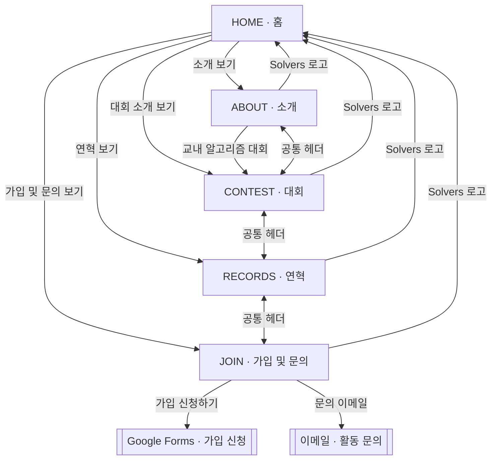

# Solvers 홈페이지 설계

## 1. 서비스 개요

Solvers 홈페이지는 한신대학교 알고리즘 소모임의 활동을 소개하고 가입으로 연결하는 홍보 사이트다.

- 소모임 표어: `We make better solvers.`
- 주요 활동: 스터디, 교내 대회 개최, 외부 대회 참여
- 주요 방문자: 한신대학교 재학생, 가입 희망자, 교내 대회 참가자
- 지원 환경: 데스크톱과 모바일 웹 브라우저
- 공개 주소: `https://hanshin-solvers.github.io/homepage/`

## 2. 핵심 경험

1. 홈에서 Solvers의 성격과 네 가지 핵심 영역을 한 화면에 파악한다.
2. 소개에서 활동과 초급반·중급반의 학습 범위를 확인한다.
3. 대회에서 연도와 시즌을 선택해 해당 대회의 포스터와 정보를 확인한다.
4. 연혁에서 운영진과 외부 대회 성적을 연도별로 확인한다.
5. 가입 및 문의에서 Google Forms와 이메일로 바로 이동한다.

## 3. 정보 구조

| 경로                 | 화면         | 핵심 콘텐츠                               |
| -------------------- | ------------ | ----------------------------------------- |
| `/homepage/`         | 홈           | 소개, 대회, 연혁, 가입 및 문의 챕터       |
| `/homepage/about/`   | 소개         | 소모임 소개, 스터디, 대회 개최, 대회 참여 |
| `/homepage/contest/` | 대회         | 연도·시즌 선택, 포스터, 일시, 장소        |
| `/homepage/records/` | 연혁         | 운영진, 연도별 외부 대회 성적             |
| `/homepage/join/`    | 가입 및 문의 | 가입 신청 링크, 담당자 이메일             |

### 화면 이동



상세 화면의 공통 헤더는 `Solvers`, `소개`, `대회`, `연혁`, `가입 및 문의` 링크를 제공한다.

## 4. 시각 디자인

### 4.1 색상

| 역할        | 색상      | 용도                      |
| ----------- | --------- | ------------------------- |
| 배경        | `#ffffff` | 전체 배경                 |
| 기본 표면   | `#f7f9fb` | 홈 챕터 선택 영역         |
| 강조 표면   | `#f2f3f5` | 호버와 보조 상태          |
| 본문        | `#191f28` | 제목과 주요 정보          |
| 보조 본문   | `#6b7684` | 설명과 메타데이터         |
| 학교 상징색 | `#472f91` | 선택 상태와 핵심 링크     |
| 진한 상징색 | `#33206f` | 강조 링크의 상호작용 상태 |
| 경계선      | `#e5e8eb` | 헤더, 푸터, 탭 구분       |

학교 상징색은 선택된 챕터와 기간 탭, 핵심 이동 링크에 집중한다. 가입 링크와 이메일, 운영진 연락처는 기본 본문 색을 사용한다.

### 4.2 타이포그래피

- `Solvers` 워드마크: Montserrat Alternates, Thin 100
- 한글 본문: Pretendard 계열
- 상세 화면 대표 제목: 데스크톱 `32px`, 모바일 `28px`
- 상세 화면 소제목: `22px`
- 본문: 콘텐츠 역할에 따라 `14px~17px`
- 본문 행간: `1.7~1.8`

### 4.3 레이아웃

- 상세 화면의 헤더, 본문, 푸터는 중앙 `800px` 축을 공유한다.
- 상세 화면 대표 제목은 대회 화면과 같은 세로 위치에서 시작한다.
- 헤더와 푸터의 경계선이 내비게이션과 본문을 구분한다.
- 본문은 제목, 짧은 문단, 충분한 여백을 중심으로 구성한다.
- 짧은 상세 화면의 푸터는 뷰포트 하단에 배치된다.
- 푸터는 저작권 문구와 소모임 표어를 표시한다.

## 5. 반응형 규칙

### 5.1 홈

- 홈은 콘텐츠와 챕터 선택 영역으로 `100svh`를 채운다.
- 데스크톱은 왼쪽 콘텐츠와 오른쪽 세로형 4개 챕터 버튼으로 구성한다.
- 모바일은 콘텐츠와 하단 가로형 4개 챕터 버튼으로 구성한다.
- 선택 챕터는 5초 간격으로 순환한다.
- 챕터 버튼을 선택하면 해당 콘텐츠가 즉시 표시된다.
- 긴 영문 제목은 모바일에서 두 단어 단위로 줄을 구성한다.
- 표어, 설명, 상세 화면 링크는 콘텐츠 영역 하단에 정렬한다.

### 5.2 상세 화면

- 데스크톱과 모바일은 같은 정보 구조와 콘텐츠 순서를 사용한다.
- 모바일 본문 여백은 좌우 `16px`을 기준으로 한다.
- 모바일 헤더는 워드마크와 네 개의 이동 링크를 한 줄에 배치한다.
- 내비게이션과 기간 탭은 최소 `44px` 높이의 터치 영역을 제공한다.
- 소개의 지정 줄바꿈은 `560px` 이하 화면에서 적용된다.
- 대표 제목의 글꼴, 굵기, 행간과 시작 높이는 기기별로 통일한다.

## 6. 화면별 설계

### 6.1 홈

홈 챕터는 소개, 대회, 연혁, 가입 및 문의 순서로 배치한다. 각 챕터는 영문 제목, 짧은 설명, 상세 화면 링크로 구성한다.

### 6.2 소개

- 소개 문장과 활동 영역을 순서대로 배치한다.
- 활동 영역은 스터디, 대회 개최, 대회 참여의 세 문단으로 구성한다.
- 스터디 문단 아래에 초급반과 중급반의 학습 범위를 배치한다.
- 대회 개최 문단의 교내 알고리즘 대회 링크는 대회 화면으로 연결한다.

### 6.3 대회

- 기간 탭은 `연도: 시즌` 형식으로 중앙에 배치한다.
- 최근 기간을 첫 항목과 기본 선택 상태로 배치한다.
- 같은 연도에서는 Fall, Spring 순서로 배치한다.
- 선택 기간의 콘텐츠 한 건을 동일한 영역에 표시한다.
- 포스터는 뷰포트 높이에 맞춰 축소하며 원본 비율을 유지한다.
- 설명은 `일시 : 내용`, `장소 : 내용` 두 줄로 구성한다.

### 6.4 연혁

- 연도 탭은 콘텐츠 영역 중앙에 배치한다.
- 최근 연도를 기본 선택 상태로 배치한다.
- 선택 연도의 성적을 동일한 영역에 표시한다.
- 운영진은 직책, 이름, 연락처 순서로 표시한다.
- 같은 연도의 외부 대회 성적은 날짜 오름차순으로 표시한다.
- 대회명, 예선·본선 구분, 날짜, 결과를 함께 표시한다.
- 대회 설명은 각 Markdown 파일의 `summary` 한 문장으로 관리한다.

### 6.5 가입 및 문의

- 가입 신청과 문의를 한 화면에 배치한다.
- 가입 신청은 Google Forms 외부 링크로 연결한다.
- 문의는 담당자 정보와 이메일 링크로 구성한다.
- 담당자와 이메일은 가로 공간에 맞춰 한 줄 또는 여러 줄로 배치한다.

## 7. 콘텐츠 관리

Astro Content Collections와 Markdown 파일을 사용한다. 실제 문구, 일정, 연락처와 성적은 `src/content`의 Markdown을 단일 기준으로 관리한다.

```text
src/content/
├── home/index.md
├── about/index.md
├── studies/index.md
├── contests/[year]-[season].md
├── members/[slug].md
├── competitions/[slug].md
└── join/index.md
```

| 컬렉션         | 관리 내용           | 주요 필드                                                     |
| -------------- | ------------------- | ------------------------------------------------------------- |
| `home`         | 홈의 네 챕터        | `title`, `slogan`, `chapters`                                 |
| `about`        | 소개와 세 가지 활동 | `title`, `intro`, `activities`                                |
| `studies`      | 초급반과 중급반     | `title`, `intro`, `tracks`                                    |
| `contests`     | 교내 대회           | `year`, `season`, `summary`, `schedule`, `location`, `images` |
| `members`      | 운영진              | `name`, `role`, `email`, `order`                              |
| `competitions` | 외부 대회 성적      | `title`, `year`, `date`, `division`, `summary`, `result`      |
| `join`         | 가입과 문의         | `apply`, `contact`                                            |

새 교내 대회 Markdown 파일은 대회 기간 탭에 연결된다. 새 외부 대회 성적의 연도는 연혁의 연도 탭에 연결된다.

이미지 자산은 `public/images`에서 관리하며 Markdown에는 `/images/...` 경로를 작성한다.

## 8. 접근성과 상호작용

- 챕터와 기간 선택은 `tablist`, `tab`, `tabpanel` 구조를 사용한다.
- 기간 탭은 좌우 방향키, Home, End 키를 지원한다.
- 현재 화면과 선택 상태는 `aria-current`, `aria-selected`로 전달한다.
- 포스터 이미지는 대회명을 포함한 대체 텍스트를 제공한다.
- 링크와 버튼은 키보드 포커스와 터치 입력을 지원한다.
- 사용자의 모션 설정에 따라 전환 시간을 조절한다.

## 9. 빌드와 배포

- 프레임워크: Astro 정적 사이트
- 사이트 기준 주소: `https://hanshin-solvers.github.io`
- 배포 기준 경로: `/homepage`
- 콘텐츠 검사와 빌드: `npm run build`
- CI: Pull Request와 `main` push에서 콘텐츠 검사와 정적 빌드 실행
- 배포: `main` push와 수동 실행에서 GitHub Pages 배포
- GitHub Pages Source: GitHub Actions

Markdown과 코드 변경 사항을 `main` 브랜치에 반영하면 GitHub Actions가 사이트를 검사하고 배포한다.
